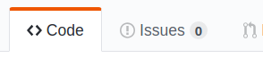
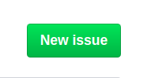
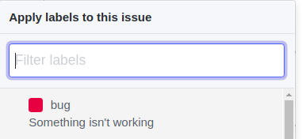
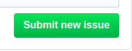
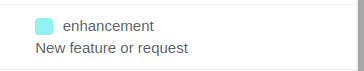

# Contributing

Thanks for joining the Volentix community!

## Table of Contents

- [Code Of Conduct](https://github.com/Volentix/documentation/blob/master/CODE_OF_CONDUCT.md)

<!-- toc -->

- [About](#about)
- [Escalation](#escalation)
- [Communication](#communication)
- [What We Are Looking For](#what-we-are-looking-for)
- [Contributing](#contributing)
  * [Pull Request](#pull-request)
    + [Process](#process)
  * [Report A Bug](#report-a-bug)
    + [Warning](#warning)
    + [Process](#process-1)
  * [Suggest A Feature](#suggest-a-feature)
    + [Process](#process-2)
- [Collect You VTX](#collect-you-vtx)
  * [Setting A Value](#setting-a-value)

<!-- tocstop -->

## About

The following provides guidance on the processes for both:
1. Contributing to Volentix
2. Renumberation of effort

## Escalation

In the event that you are not satisfied as a contributor, please send a message to arbitrator@volentix.io

In the message, please provide as much information as possible. You will recieve a message back from the arbitrator within 48 hrs.

## Communication

Each project is expected to manage their own communication and platform. Please see the project file CONTRIBUTING.md file for specifics. If the project does not list a communication channel, please escalate using the process [Escalation](#escalation) above.

## What We Are Looking For

In addition to the communication channels, the projects root CONTRIBUTING.md file will also provide a section outlining the kind of work they are looking for at the moment.

## Styling

Each project is responsible for providing its own code style guides. Please see the projects CONTRIBUTING.md file for details.

## Contributing

Developers can contribute in the following ways:

1. Pull Request
2. Report A Bug
3. Suggest A Feature

### Pull Request

If you are looking to do some development work, its best to start by picking a few issues before proposing new features of your own. In general, the team would be more comforable after they have seen the 'cut of your jib', as it were.

In order to begin, look for issues with one of the following tags:

1. **Good First Issue:** These are considered to be something small that you can start with.
2. **Help Wanted:** These are stories with a little but more meat on the bones.

#### Process

Once you have selected an issue you would like to work on, you will need to:

1. **Fork** the repo into your own repo.
2. **Clone** the repo locally
3. **Create** new branch. The prefix must be the issue number you are working on.

Once you have completed your work, go to your cloned repository and make a pull request. Before doing so, make sure that:

1. Project can be successfully built and packaged
2. Any documenation updates have been completed
3. Information provided in the pull request (templated)
4. Code review performed by team developers and approved

At this point, you have completed a full iteration of contributing code assets to the Volentix ecosystem. Congrats!

### Report A Bug

See something, say something. Filing bugs are helpful and can get you VTX. 

#### Warning

Do not report security bugs using this process. If you would like to file a security bug report, please follow the [Volentix Standard Security Policy](https://github.com/Volentix/documentation/blob/master/SECURITY.md)

#### Process

1. Go to the Issues tab in the repository.



2. Select New Issue



3. Provide a title in the title section.
4. Fill in the issue template.
5. On the right side, select the labels settings.


6. Select the `bug` label



7. Submit the issue.



8. Let the team know!

Once the bug has been submited, you will receive a response within 48 hours. 

### Suggest A Feature

If you have a great idea for a feature, improvement, or adjustment, please let the team know.

#### Process

Suggesting a feature is the same as submiting a bug, however, you will choose the `enhancement` label rather than the `bug` label.



## Collect You VTX

Part of contributing to the Volentix ecosystem is the opportunity for you as developers to be compensated with VTX. VTX is the native token of utility for the Volentix ecosystem.

In order being rewarded with VTX for your contribution, you must first have the following:

1. A Verto public address.
2. KYC'd through one of the KYC providers. If you do not know how to KYC, please feel free to ask on the [Telegram Channel](https://t.me/vertosupport/)

**Note**
```
You do not have to be KYC'd before starting to work. The two can be done in parellel.
```

### Setting A Value

The process for setting value on work is pretty flexible and teams are free to customize the process for their own needs. Note that whatever the team decides, the Governance organization will audit the process in order to ensure its fairness and fair value.

With the above in mind, the team may, for example, set a base bounty for bugs and features, however, it may also allow for bartering.

For issues ready for development, each issue will have a reward attached to it. Of course, as with bug/feature submissions, this should also be negotiable.

